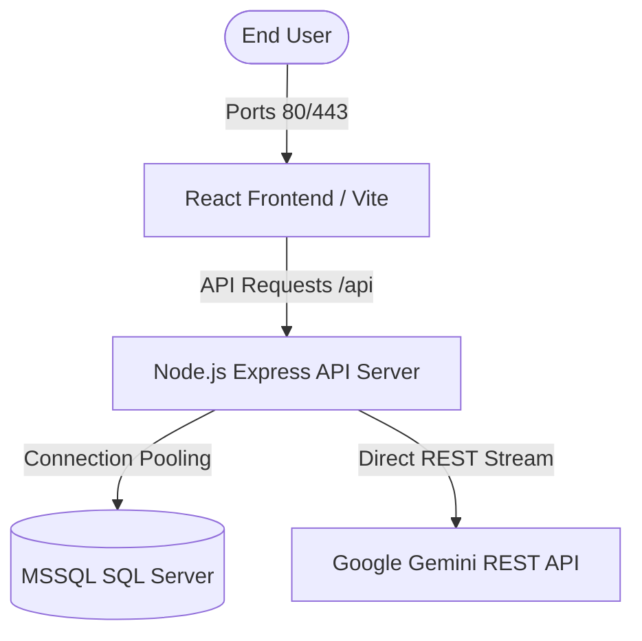

# ⚡ Task & Expense Management Hub (Intelligence Cockpit)

A premium, state-of-the-art enterprise workspace designed to streamline corporate task delegation, track real-time project outflows, file receipted claims, and inspect chronological audit trails under an elegant HSL-tailored Light-themed UI. Features an integrated operations intelligence engine—**Synapse AI**—delivering direct database RAG querying capabilities.

---

## ✨ Features Cockpit

* **🤖 Synapse AI Copilot**: A secure, context-aware operations intelligence engine connecting directly to live database pools to answer query facts about workforce task allocations, overdue tasks, category expenses, and project burn downs in natural language.
* **📂 Visual Project Grids**: Tabular dashboards upgraded to interactive progress cards featuring dynamic task progress bars, color-coded budget warnings (green, amber, or critical rose depending on spending burn rates), and supervisor metadata.
* **📋 Task Delegation & Tracking**: Assign, schedule, filter, and track tasks dynamically with fluid state transitions. Includes a responsive calendar monthly timeline with full horizontal touch-swipe support.
* **💳 Expense Management**: Streamlined expense filing with receipt attachments, categorical grouping, manager approvals/rejection flows, and spreadsheet exports.
* **🔒 Enterprise Security & Audit**: 
  * Parameterized SQL Server database transactions protecting 100% against SQL Injection.
  * SHA-256 geometric vector-path CAPTCHA protecting against automated bots.
  * Honeypot protection silent spam filtering.
  * Rigid HTTPOnly cookie-based JWT session authentication preventing XSS and CSRF.
  * Chronological system audit trail logging all administrative, manager, and employee events.
* **📱 100% Device Responsiveness**: Viewport-aware layout bounds engineered to adapt flawlessly to viewports down to `320px` (iPhone SE) all the way up to ultra-wide desktop grids.

---

## 🛠️ Technology Stack

* **Frontend**: React 19, Vite, Tailwind CSS v4, TanStack React Query, Framer Motion, Recharts.
* **Backend**: Node.js, Express.js, JWT Cookies, Multer File Uploads.
* **Database**: Microsoft SQL Server (MSSQL) with customized connection pooling limits.
* **AI Model**: Google Gemini API via secure direct REST RAG integration.

---

## 📁 System Architecture



---

## 🚀 Quick Start Guide

### 1. Prerequisites
Ensure you have the following installed on your local host system:
* Node.js (v20 or higher)
* Microsoft SQL Server (MSSQL)
* npm (v10 or higher)

### 2. Database Schema Setup
Execute the SQL scripts located inside the `/database/migration.sql` directory on your SQL Server instance to initialize the relational schema, tables, triggers, and indices.
To populate the default corporate metrics and metadata, run the database seed command inside the `/server` folder:
```bash
npm run seed
```

### 3. Server Configuration & Setup
1. Navigate to the server workspace:
   ```bash
   cd server
   ```
2. Install all required dependencies:
   ```bash
   npm install
   ```
3. Create a `.env` file in the root of the `server/` directory and configure the environment variables:
   ```env
   PORT=5000
   DB_USER=your_db_user
   DB_PASSWORD=your_db_password
   DB_SERVER=localhost
   DB_DATABASE=task_expense_db
   DB_PORT=1433
   JWT_SECRET=your_jwt_signing_key_here
   GEMINI_API_KEY=your_gemini_api_key_here
   ```
4. Boot the active backend service:
   ```bash
   npm start
   ```

### 4. Client Configuration & Setup
1. Navigate to the client workspace:
   ```bash
   cd ../client
   ```
2. Install all dependencies:
   ```bash
   npm install
   ```
3. Boot the local development hot-reload server:
   ```bash
   npm run dev
   ```
4. The client will be active at `http://localhost:5173`.

---

## 🛡️ License & Clearances
Distributed under secure enterprise policies. All system clearances and authentication regulations apply.
